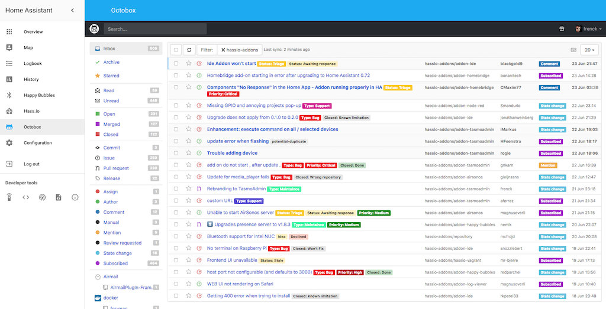
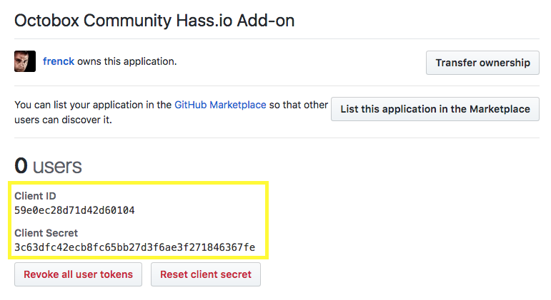

# Community Hass.io Add-ons: Octobox

[![GitHub Release][releases-shield]][releases]
![Project Stage][project-stage-shield]
[![License][license-shield]](LICENSE.md)

[![GitLab CI][gitlabci-shield]][gitlabci]
![Project Maintenance][maintenance-shield]
[![GitHub Activity][commits-shield]][commits]

[![Bountysource][bountysource-shield]][bountysource]
[![Discord][discord-shield]][discord]
[![Community Forum][forum-shield]][forum]

[![Buy me a coffee][buymeacoffee-shield]][buymeacoffee]

Take back control of your GitHub notifications.



## About

If you manage more than one active project on GitHub, you probably find
GitHub notifications pretty lacking.

Notifications are marked as read and disappear from the list as soon as you load
the page or view the email of the notification. This makes it very hard to keep
on top of which notifications you still need to follow up on.

Most open source maintainers and GitHub staff end up using a complex combination
of filters and labels in Gmail to manage their notifications from their inbox.
If you are like me, try to avoid email, then you might want something else.

Octobox is a beautiful application that manages your GitHub notifications via
GitHub’s API, allowing you to filter down by organization, project,
notification type, or the reason why you are receiving the notification in the
first place.

It is easy to drill down into the issues that matter to you in the current
moment while still allowing you to be subscribed to projects that you’d like
to keep an eye on. You can quickly address threads that you’ve authored yourself
or remember that you still need to submit your review that someone requested.
You can “star” long-running issues that you know might be important down the
road.

A real must-have for every GitHub opensource contributor.

## Installation

The installation of this add-on is pretty straightforward and not different in
comparison to installing any other Hass.io add-on.

1. [Add our Hass.io add-ons repository][repository] to your Hass.io instance.
1. Install the "Octobox" add-on.
1. [Register a GitHub application](#registering-a-github-application),
   and set the `github_client_id` and `github_client_secret` add-on options.
1. Start the "Octobox" add-on
1. Check the logs of the "Octobox" add-on to see if everything went well.

**NOTE**: Starting the add-on might take a couple of minutes (especially the
first time starting the add-on).

**NOTE**: Do not add this repository to Hass.io, please use:
`https://github.com/hassio-addons/repository`.

## Docker status

![Supports armhf Architecture][armhf-shield]
![Supports aarch64 Architecture][aarch64-shield]
![Supports amd64 Architecture][amd64-shield]
![Supports i386 Architecture][i386-shield]

[![Docker Layers][layers-shield]][microbadger]
[![Docker Pulls][pulls-shield]][dockerhub]

## Configuration

**Note**: _Remember to restart the add-on when the configuration is changed._

Example add-on configuration:

```json
{
  "log_level": "info",
  "github_client_id": "59e0ec28d71d42d60104",
  "github_client_secret": "3c63dfc42ecb8fc65bb27d3f6ae3f271846367fe",
  "username": "MarryPoppins",
  "password": "Supercalifragilisticexpialidocious",
  "ssl": true,
  "certfile": "fullchain.pem",
  "keyfile": "privkey.pem",
  "sync_timeout": 600,
  "fetch_subject": true,
  "minimum_refresh_interval": 1,
  "allow_personal_access_token": false,
  "github_restrict_access": false,
  "github_organization_id": 0,
  "github_team_id": 0,
  "ipv6": false
}
```

**Note**: _This is just an example, don't copy and past it! Create your own!_

### Option: `log_level`

The `log_level` option controls the level of log output by the addon and can
be changed to be more or less verbose, which might be useful when you are
dealing with an unknown issue. Possible values are:

- `trace`: Show every detail, like all called internal functions.
- `debug`: Shows detailed debug information.
- `info`: Normal (usually) interesting events.
- `warning`: Exceptional occurrences that are not errors.
- `error`:  Runtime errors that do not require immediate action.
- `fatal`: Something went terribly wrong. Add-on becomes unusable.

Please note that each level automatically includes log messages from a
more severe level, e.g., `debug` also shows `info` messages. By default,
the `log_level` is set to `info`, which is the recommended setting unless
you are troubleshooting.

### Option: `github_client_id`

The GitHub application client ID for Octobox. You can get this ID by
registering a new application on GitHub.

For more information, please see the "Registering a GitHub application" chapter.

### Option: `github_client_secret`

The GitHub application client ID for Octobox. You can get this secret by
registering a new application on GitHub.

For more information, please see the "Registering a GitHub application" chapter.

### Option: `username`

Username for authenticating with the Octobox interface. Leaving the username
field empty, will disable the authentication mechanism entirely.

Octox is already protected by a GitHub authentication, nevertheless, other
users might still use your installation (still, they need to authenticate
with their own GitHub account).

Setting a username/password can be added as an extra line of defense,
to prevent users of using your installation for themselves.

This option is HIGHLY recommended in case you expose this add-on to the outside
world.

### Option: `password`

Password for authenticating with Octobox interface.

### Option: `ssl`

Enables/Disables SSL (HTTPS) on the web interface of Octobox. Set it `true`
to enable it, `false` otherwise.

### Option: `certfile`

The certificate file to use for SSL.

**Note**: _The file MUST be stored in `/ssl/`, which is the default for Hass.io_

### Option: `keyfile`

The private key file to use for SSL.

**Note**: _The file MUST be stored in `/ssl/`, which is the default for Hass.io_

### Option: `sync_timeout`

The add-on will sync the notification automatically in the background using
a special task. This option allows you to specify a timeout before each sync.

For example, setting this to `900` will automatically sync you
the notifications every 15 minutes.

### Option: `fetch_subject`

Experimental feature for downloading extra information about the subject of
each notification, namely:

- Author for Issues, Pull Requests, Commit Comments and Releases
- State (open/closed/merged) for Issues, Pull Requests
- Labels

This feature is enabled by default in this add-on, but can be disabled by
setting this option to `false`.

If you want this feature to work for private repositories, you'll need to
Customize the Scopes on GitHub adding the `repo` scope to allow Octobox to get
subject information for private issues and pull requests.

### Option: `minimum_refresh_interval`

You may allow users to set an auto-refresh interval that will cause a periodic
sync and page reload when they are viewing notifications.

To disable this simply set the environment variable `minimum_refresh_interval`
to 0. `minimum_refresh_interval` is the lowest number of minutes between
auto-syncs that the add-on will allow.

### Option: `allow_personal_access_token`

Octobox can optionally allow you to set a personal access token to use when
querying for notifications. This must be enabled at add-on level, by setting
this option to `true`.

Once that is set, users can set a personal access token on the Settings
page (found on the user drop-down menu).

### Option: `github_restrict_access`

You can restrict access to your Octobox instance, and only allow members of a
GitHub organization or team. To limit access set the configuration option
`github_restrict_access` to `true`. Next set either `github_organization_id`
or `github_team_id`.

### Option: `github_organization_id`

This option allows you to limit access to your add-on, by only allowing access
to Octobox for members of a specific GitHub organization.

You can get an organization's ID with this curl command:

```bash
curl https://api.github.com/orgs/<org_name>
```

### Option: `github_team_id`

This option allows you to limit access to your add-on, by only allowing access
to Octobox for members of a specific GitHub team.

You can get a team's ID with this curl command:

```bash
curl https://api.github.com/orgs/<org_name>/teams
```

Find your team on the list and copy its ID.

### Option: `ipv6`

Set this option too `false` to disable IPv6 support.

## Registering a GitHub application

Octobox works as a GitHub application. In order to work, this application
must be registered with GitHub. Every registered OAuth application is assigned
a unique Client ID and Client Secret, which is needed by this add-on.

Surf to the following URL to register a new GitHub application:

<https://github.com/settings/applications/new>

You can fill out every piece of information however you like, except the
**Authorization callback URL**. This is easily the most important piece to
set up your Octobox. It's the callback URL that GitHub returns the user
to after successful authentication.

The configuration for Octobox should look something like this:


After creating it, GitHub should show you your GitHub's application Client ID
and Client Secret.



Use them both in the matching add-on configuration options.

## Embedding into Home Assistant

It is possible to embed Octobox directly into Home Assistant, allowing you to
access your Octobox through the Home Assistant frontend.

Home Assistant provides the `panel_iframe` component, for these purposes.

Example configuration:

```yaml
panel_iframe:
  octobox:
    title: Octobox
    icon: mdi:github-face
    url: http://addres.to.your.hass.io:3333
```

## Changelog & Releases

This repository keeps a change log using [GitHub's releases][releases]
functionality. The format of the log is based on
[Keep a Changelog][keepchangelog].

Releases are based on [Semantic Versioning][semver], and use the format
of ``MAJOR.MINOR.PATCH``. In a nutshell, the version will be incremented
based on the following:

- ``MAJOR``: Incompatible or major changes.
- ``MINOR``: Backwards-compatible new features and enhancements.
- ``PATCH``: Backwards-compatible bugfixes and package updates.

## Support

Got questions?

You have several options to get them answered:

- The Home Assistant [Community Forum][forum], we have a
  [dedicated topic][forum] on that forum regarding this add-on.
- The Home Assistant [Discord Chat Server][discord] for general Home Assistant
  discussions and questions.
- Join the [Reddit subreddit][reddit] in [/r/homeassistant][reddit]

You could also [open an issue here][issue] GitHub.

## Contributing

This is an active open-source project. We are always open to people who want to
use the code or contribute to it.

We have set up a separate document containing our
[contribution guidelines](CONTRIBUTING.md).

Thank you for being involved! :heart_eyes:

## Authors & contributors

The original setup of this repository is by [Franck Nijhof][frenck].

For a full list of all authors and contributors,
check [the contributor's page][contributors].

## We have got some Hass.io add-ons for you

Want some more functionality to your Hass.io Home Assistant instance?

We have created multiple add-ons for Hass.io. For a full list, check out
our [GitHub Repository][repository].

## License

MIT License

Copyright (c) 2018 Franck Nijhof

Permission is hereby granted, free of charge, to any person obtaining a copy
of this software and associated documentation files (the "Software"), to deal
in the Software without restriction, including without limitation the rights
to use, copy, modify, merge, publish, distribute, sublicense, and/or sell
copies of the Software, and to permit persons to whom the Software is
furnished to do so, subject to the following conditions:

The above copyright notice and this permission notice shall be included in all
copies or substantial portions of the Software.

THE SOFTWARE IS PROVIDED "AS IS", WITHOUT WARRANTY OF ANY KIND, EXPRESS OR
IMPLIED, INCLUDING BUT NOT LIMITED TO THE WARRANTIES OF MERCHANTABILITY,
FITNESS FOR A PARTICULAR PURPOSE AND NONINFRINGEMENT. IN NO EVENT SHALL THE
AUTHORS OR COPYRIGHT HOLDERS BE LIABLE FOR ANY CLAIM, DAMAGES OR OTHER
LIABILITY, WHETHER IN AN ACTION OF CONTRACT, TORT OR OTHERWISE, ARISING FROM,
OUT OF OR IN CONNECTION WITH THE SOFTWARE OR THE USE OR OTHER DEALINGS IN THE
SOFTWARE.

[aarch64-shield]: https://img.shields.io/badge/aarch64-yes-green.svg
[amd64-shield]: https://img.shields.io/badge/amd64-yes-green.svg
[anchore-shield]: https://anchore.io/service/badges/image/67d1185473090e99d5ac5e1bb4d1aa2295117a9bd3d7abbf8cd8a71e331c8388
[anchore]: https://anchore.io/image/dockerhub/hassioaddons%2Funifi%3Alatest
[armhf-shield]: https://img.shields.io/badge/armhf-yes-green.svg
[bountysource-shield]: https://img.shields.io/bountysource/team/hassio-addons/activity.svg
[bountysource]: https://www.bountysource.com/teams/hassio-addons/issues
[buymeacoffee-shield]: https://www.buymeacoffee.com/assets/img/guidelines/download-assets-sm-2.svg
[buymeacoffee]: https://www.buymeacoffee.com/frenck
[commits-shield]: https://img.shields.io/github/commit-activity/y/hassio-addons/addon-ocotbox.svg
[commits]: https://github.com/hassio-addons/addon-octobox/commits/master
[contributors]: https://github.com/hassio-addons/addon-octobox/graphs/contributors
[discord-shield]: https://img.shields.io/discord/330944238910963714.svg
[discord]: https://discord.gg/c5DvZ4e
[dockerhub]: https://hub.docker.com/r/hassioaddons/octobox
[forum-shield]: https://img.shields.io/badge/community-forum-brightgreen.svg
[forum]: https://community.home-assistant.io/?u=frenck
[frenck]: https://github.com/frenck
[gitlabci-shield]: https://gitlab.com/hassio-addons/addon-octobox/badges/master/pipeline.svg
[gitlabci]: https://gitlab.com/hassio-addons/addon-octobox/pipelines
[home-assistant]: https://home-assistant.io
[i386-shield]: https://img.shields.io/badge/i386-yes-green.svg
[issue]: https://github.com/hassio-addons/addon-octobox/issues
[keepchangelog]: http://keepachangelog.com/en/1.0.0/
[layers-shield]: https://images.microbadger.com/badges/image/hassioaddons/octobox.svg
[license-shield]: https://img.shields.io/github/license/hassio-addons/addon-octobox.svg
[maintenance-shield]: https://img.shields.io/maintenance/yes/2018.svg
[microbadger]: https://microbadger.com/images/hassioaddons/octobox
[project-stage-shield]: https://img.shields.io/badge/project%20stage-experimental-yellow.svg
[pulls-shield]: https://img.shields.io/docker/pulls/hassioaddons/octobox.svg
[reddit]: https://reddit.com/r/homeassistant
[releases-shield]: https://img.shields.io/github/release/hassio-addons/addon-octobox.svg
[releases]: https://github.com/hassio-addons/addon-octobox/releases
[repository]: https://github.com/hassio-addons/repository
[semver]: http://semver.org/spec/v2.0.0.htm
